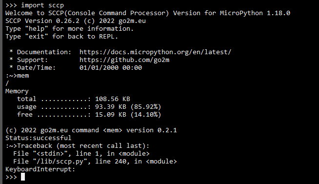

SCCP- Secure Console Command Processor
======================================

The Secure Console Command Processor(sccp) executes console commands::

	for example,
	system information
	tcp/ip configuration
	file directory
	memory size

the description of the commands follows below.
First, we clarify the requirements for using sccp::

	1. check wifi connection
	2. import webrepl
		webrepl.start()
	WebREPL is not configured, run 'import webrepl_setup'
	3. import webrepl_setup
	WebREPL daemon auto-start status: disabled

	Would you like to (E)nable or (D)isable it running on boot?
	(Empty line to quit)
	> e
	To enable WebREPL, you must set password for it
	New password (4-9 chars): micro
	

.. image:: images/image1.PNG
.. image:: images/image2.PNG